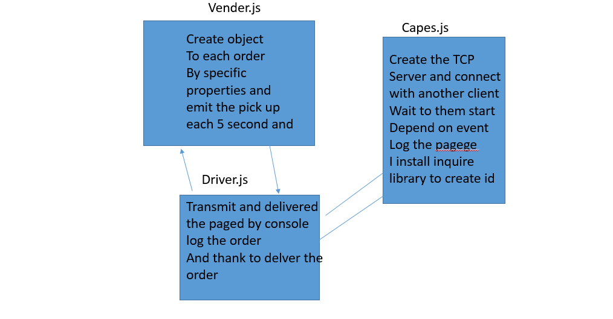

# CAPS

LAB - 17

Author: bayan alalem
ci/cd:[ci/cd ](https://github.com/bayan-97/CAPS/actions)
Setup

 `npm init -y` 

## detailes about files

### CAPS Application Server
1. Creates a pool of connected clients
Accept inbound TCP connections on a declared port
On new connections, add the client to the connection pool
On incoming data from a client
2. Read and parse the incoming data/payload
Verify that the data is legitimate
Is it a JSON object with both an event and payload properties?
If the payload is ok, broadcast the raw data back out to each of the other connected clients
### Vendor Application

Use .env to set your store name
Connect to the CAPS server
Every 5 seconds, simulate a new customer order
Create an order object with your store name, order id, customer name, address
HINT: Have some fun by using the faker library to make up phony information
Create a message object with the following keys:
event - ‘pickup’
payload - the order object you created in the above step
Write that message (as a string) to the CAPS server
Listen for the data event coming in from the CAPS server
When data arrives, parse it (it should be JSON) and look for the event property
If the event is called delivered
Log “thank you for delivering id” to the console
Ignore any data that specifies a different event
### driver.js

1. Connect to the CAPS server
Listen for the data event coming in from the CAPS server
2. When data arrives, parse it (it should be JSON) and look for the event property and begin processing…
If the event is called pickup
Simulate picking up the package
3. Wait 1 second
Log “picking up id” to the console
Create a message object with the following keys:
event - ‘in-transit’
payload - the payload from the data object you just received
4.Write that message (as a string) to the CAPS server
Simulate delivering the package
Wait 3 seconds
5. Create a message object with the following keys:
event - ‘delivered’
payload - the payload from the data object you just received
Write that message (as a string) to the CAPS server

**refactores our code**
## Running the app

`nodemon`

Returns 

UML Diagram
