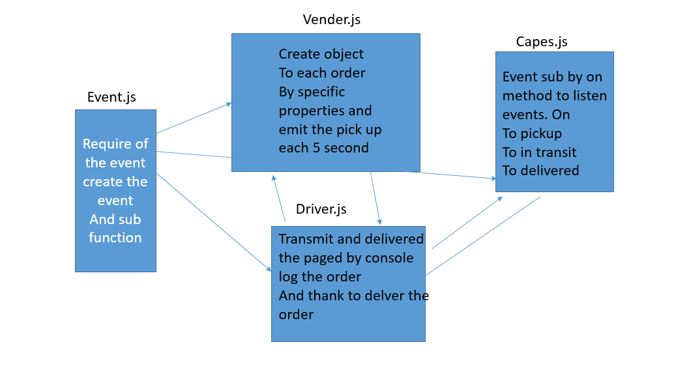

# CAPS

LAB - 16

Author: bayan alalem
ci/cd:[ci/cd ](https://github.com/bayan-97/CAPS/actions)
Setup

 `npm init -y` 

## detailes about files

### events.js
Global Event Pool 
### caps.js
1. Manages the state of every package (ready for pickup, in transit, delivered, etc)
2. Logs every event to the console with a timestamp and the event payload
`“EVENT {}”`

### vendor.js

1. Declare your store name 
2. Every 5 seconds, simulate a new customer order
Create a fake order, as an object:
storeName, orderId, customerName, address
Emit a ‘pickup’ event and attach the fake order as payload
3.  using the faker library to make up phony information
Monitor the system for events …
Whenever the ‘delivered’ event occurs
Log “thank you” to the console

### driver.js
1. Monitor the system for events …
On the ‘pickup’ event …
2. Wait 1 second
Log “DRIVER: picked up [ORDER_ID]” to the console.
Emit an ‘in-transit’ event with the payload you received
3. Wait 3 seconds

Log “delivered” to the console
Emit a ‘delivered’ event with the same payload

**refactores our code**
## Running the app

`nodemon`

Returns 

`{ event: 'pickup',`
 ` time: 2020-03-06T18:27:17.732Z,`
  `payload:`
`   { store: '1-206-flowers',`
    ` orderID: 'e3669048-7313-427b-b6cc-74010ca1f8f0',`
    ` customer: 'Jamal Braun',`
    ` address: 'Schmittfort, LA' } }`

test

UML Diagram
