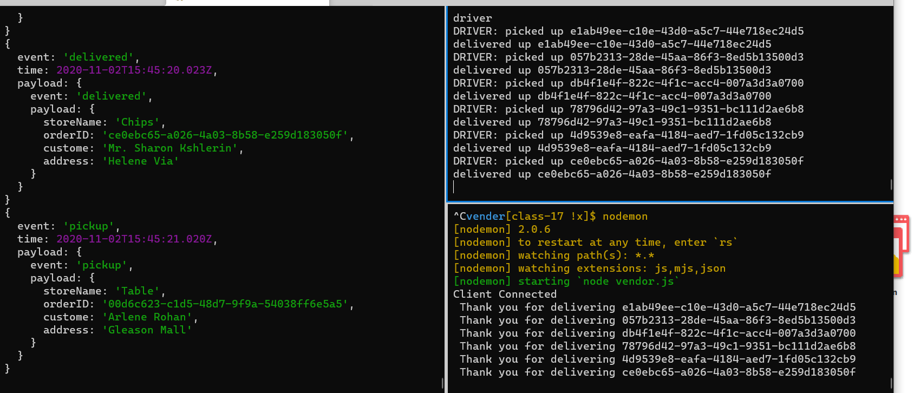
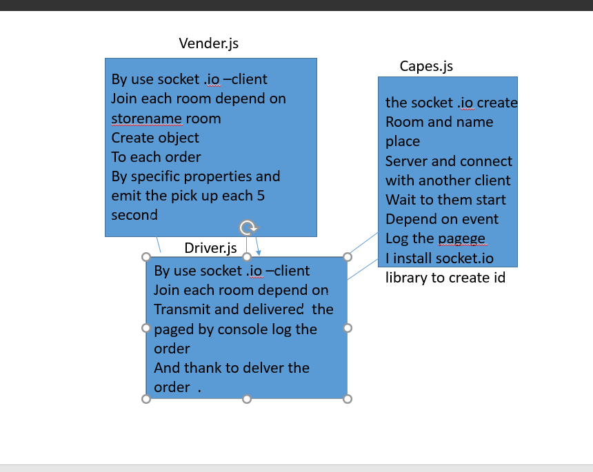

# CAPS

LAB - 17

Author: bayan alalem
ci/cd:[ci/cd ](https://github.com/bayan-97/CAPS/actions)
Setup

 `npm init -y` `npm socket.io`

## detailes about files

### CAPS Application Server
1. Start a socket.io server on a designated port
Create and accept connections on a namespace called caps
Within the namespace:
Monitor the ‘join’ event.
2. Each vendor will have their own “room” so that they only get their own delivery notifications
Monitor the correct general events
pickup, in-transit, delivered
Broadcast the events and payload back out to the appropriate clients in the caps namespace
3. pickup can go out to all sockets (broadcast it) so that the drivers can hear it
in-transit and delivered are meant to be heard only by the right vendor
Emit those messages and payload only to the room (vendor) for which the message was intended
### Vendor Application

Continue to declare your store id using .env
Connects to the CAPS server as a socket.io client to the caps namespace
Join a room named for your store
Emit a join event to the caps namespace connection, with the payload being your store code
Every .5 seconds, simulate a new customer order
Create a payload object with your store name, order id, customer name, address
Emit that message to the CAPS server with an event called pickup
Listen for the delivered event coming in from the CAPS server
Log “thank you for delivering payload.id” to the console
### driver.js

Continue to declare your store id using .env
Connects to the CAPS server as a socket.io client to the caps namespace
Join a room named for your store
Emit a join event to the caps namespace connection, with the payload being your store code
Every .5 seconds, simulate a new customer order
Create a payload object with your store name, order id, customer name, address
Emit that message to the CAPS server with an event called pickup
Listen for the delivered event coming in from the CAPS server
Log “thank you for delivering payload.id” to the console

**refactores our code**
## Running the app

`nodemon`

Returns 

UML Diagram
